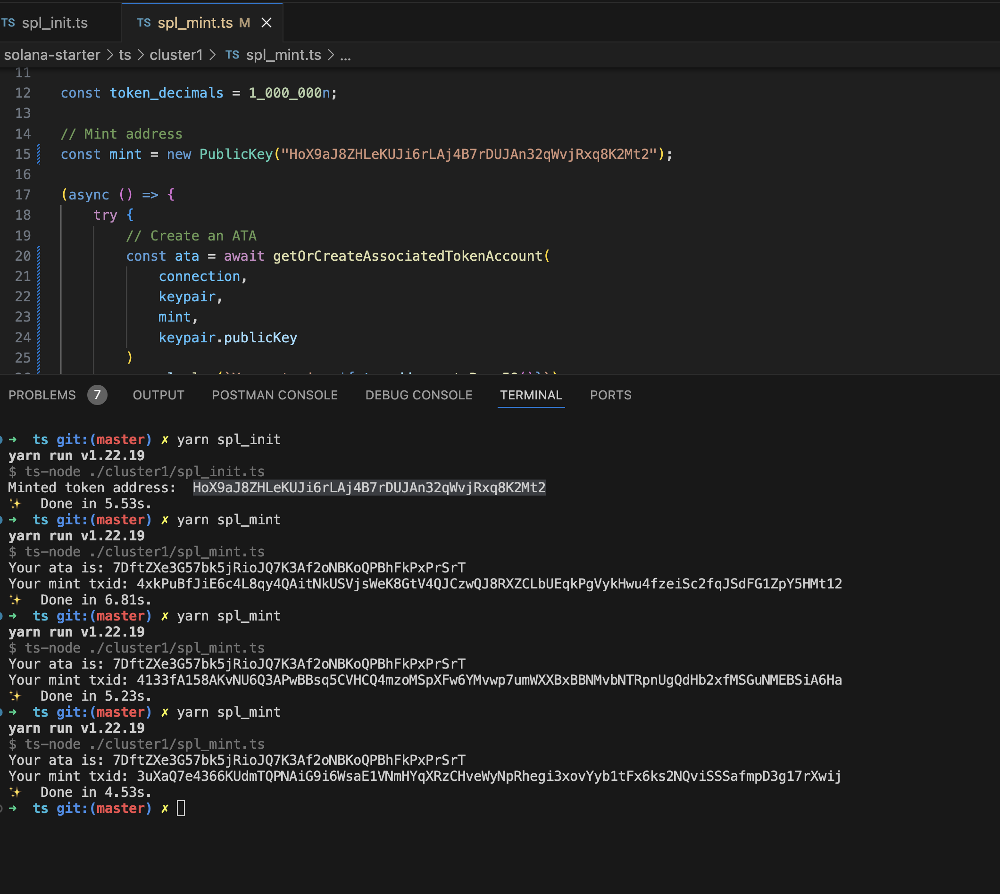
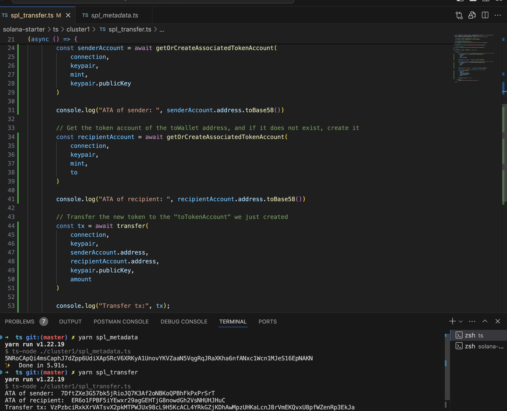

# 🪙 SPL Token on Solana Devnet

## Objective

Mint, add metadata, and transfer a custom SPL token (BCAT) on Solana Devnet.
---

## What Was Done

* Created a custom SPL token on Devnet
* Minted tokens to the creator wallet
* Sent tokens to another wallet
* Used Associated Token Accounts (ATA)

---

## Tech Stack

* Solana Devnet
* TypeScript
* `@solana/web3.js`
* `@solana/spl-token`

---

## Project Structure

```
ts/cluster1/
├── spl_init.ts     # Create SPL token mint
├── spl_mint.ts     # Mint tokens
├── spl_transfer.ts # Send tokens
├── spl_metadata.ts # Added metadata to the tokens
```

**Files changed:**
`spl_init`, `spl_mint`, `spl_metadata`, `spl_transfer` and supporting scripts

---

## How to Run

```bash
npm install
yarn spl_init
yarn spl_mint
yarn spl_metadata
yarn spl_transfer
```

---

## Mint Transaction

**Mint Tx Hash:**

```
Tx for creating mint account - https://explorer.solana.com/tx/2usMXiqeAAE4Y3omsyP2upxGxe4SaVmb7vdAxFyVRfovyA4UVZKbNMEWfVfufKBEATPjrfF1MZS3EJhA1HrkoMbB?cluster=devnet

Mint address = [HoX9aJ8ZHLeKUJi6rLAj4B7rDUJAn32qWvjRxq8K2Mt2](https://explorer.solana.com/address/HoX9aJ8ZHLeKUJi6rLAj4B7rDUJAn32qWvjRxq8K2Mt2?cluster=devnet)

Tx for creating ATA account - https://explorer.solana.com/tx/21yyr5E2GtQc96EQPjYc2GwTf9a1iXjihEQdWPBXS3uk2YYXqzNbJikYVqsM4aUGczw7fH2qwzN3HX8iduYfNCo5?cluster=devnet

Tx for minting tokens - https://explorer.solana.com/tx/3uXaQ7e4366KUdmTQPNAiG9i6WsaE1VNmHYqXRzCHveWyNpRhegi3xovYyb1tFx6ks2NQviSSSafmpD3g17rXwij?cluster=devnet

Tx for adding metadata - https://explorer.solana.com/tx/5NRoCApQi4msCaphJ7dZpp6UdiXApSRcV6XRKyA1UnovYKVZaaN5VqgRqJRaXKha6nfANxc1Wcn1MJeS16EpNAKN?cluster=devnet

Tx for tranfering tokens - https://explorer.solana.com/tx/5jaEfjwBpvvdkDeP8nuogLG6CKf4oqsJExnezWxd6KEwg2xAEMVtmojnYWYFMzghDLiXoALrqVaazrtX7Dyrrgbe?cluster=devnet
```

---

## Screenshot







